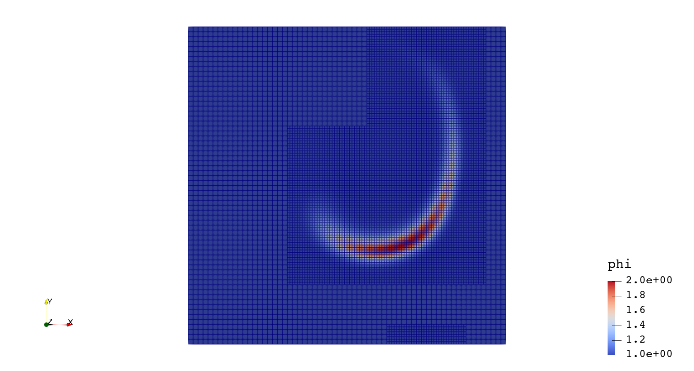

# API

## 1. 概述
> A software framework for massively parallel, block-structured adaptive mesh refinement (AMR) applications

> AMReX is developed at [LBNL ](http://www.lbl.gov/), [NREL ](https://www.nrel.gov/), and [ANL ](http://www.anl.gov/)as part of the Block-Structured AMR Co-Design Center in DOE's Exascale Computing Project (百亿亿次超算计划).

- 主要是C++，带有fortran接口

- 支持 1D、2D 和 3D

- 支持体心，面心，节点数据结构

- 支持粒子模拟，用于拉格朗日粒子追踪及多相流模拟

- 支持复杂几何的浸入边界法（切割单元）表示

- 支持分层自适应结构网格上的双曲线、抛物线和椭圆型方程求解

- 基于 MPI+X 的混合并行化策略，其中 X 是用于多核架构的 OpenMP，对于包括 NVIDIA GPU 的架构为CUDA，包括 AMD GPU 架构的为 HIP

## 2. 基础

### 2.1 数据结构

- `IntVect`与`IndexType`

  `IntVect`为无量纲整数数组容器，其维度由`AMREX_SPACEDIM`决定，常作为索引数组

  ```c++
  IntVect iv(AMREX_D_DECL(127,127,127));
  IntVect coarsening_ratio(AMREX_D_DECL(2,2,2));
  iv.coarsen(2);                 // 每个元素除以2
  iv.coarsen(coarsening_ratio);  // 同上
  const auto& iv2 = amrex::coarsen(iv, 2); // 返回一个IntVect同时修改iv
  IntVect iv3 = amrex::coarsen(iv, coarsening_ratio); // iv 不被修改
  ```

  其中，宏`AMREX_D_DECL`根据定义的维数展开成`127`或`127,127`或`127，127，127`

  `IndexType`定义了索引类型是体心还是节点，默认为全体心

  ```c++
  // Node in x-direction and cell based in y and z-directions
  IndexType xface(IntVect{AMREX_D_DECL(1,0,0)});
  ```

- `Box`

  `Box`为索引空间的抽象结构，包含一个`IndexType`和两个`IntVect`，分别表示矩形索引区域的上下角。通常定义方式为

  ```c++
  IntVect lo(AMREX_D_DECL(64,64,64));
  IntVect hi(AMREX_D_DECL(127,127,127));
  IndexType typ({AMREX_D_DECL(1,1,1)});
  Box cc(lo,hi);        // By default, Box is cell based.
  Box nd(lo,hi+1,typ);  // Construct a nodal Box.
  Print() << "A cell-centered Box " << cc << "\n";
  Print() << "An all nodal Box    " << nd << "\n";
  ```

  输出

  ```
  A cell-centered Box ((64,64,64) (127,127,127) (0,0,0))
  An all nodal Box    ((64,64,64) (128,128,128) (1,1,1))
  ```

- `BoxArray`

  在给定加密等级下的Box集合

  ```c++
  Box domain(IntVect{0,0,0}, IntVect{127,127,127});
  BoxArray ba(domain);  // Make a new BoxArray out of a single Box
  Print() << "BoxArray size is " << ba.size() << "\n";  // 1
  ba.maxSize(64);       // Chop into boxes of 64^3 cells
  Print() << ba;
  ```

  输出

  ```
  (BoxArray maxbox(8)
         m_ref->m_hash_sig(0)
  ((0,0,0) (63,63,63) (0,0,0)) ((64,0,0) (127,63,63) (0,0,0))
  ((0,64,0) (63,127,63) (0,0,0)) ((64,64,0) (127,127,63) (0,0,0))
  ((0,0,64) (63,63,127) (0,0,0)) ((64,0,64) (127,63,127) (0,0,0))
  ((0,64,64) (63,127,127) (0,0,0)) ((64,64,64) (127,127,127) (0,0,0)) )
  ```

- `FArrayBox`

  定义在`Box`上的数据（double, integer, complex, etc.）

  ```c++
  Box box(IntVect{0,0,0}, IntVect{63,63,63});
  int ncomp = 2;
  FArrayBox fab1(box, ncomp);
  FArrayBox fab2(box, ncomp);
  fab1.setVal(1.0);    // Fill fab1 with 1.0
  fab1.mult(10.0, 0);  // Multiply component 0 by 10.0
  fab2.setVal(2.0);    // Fill fab2 with 2.0
  Real a = 3.0;
  // scalar alpha X plus Y
  fab2.saxpy(a, fab1); // For both components, fab2 <- a * fab1 + fab2
  ```

- `MultiFAB`

  - 同一加密等级下`FArrayBox`的集合
  - 包含定义每个FAB所属MPI进程的`DistributionMapping`，默认使用空间填充曲线算法进行分配，在输入参数中可以自定义策略，如使用`KNAPSACK`负载均衡算法
  - AMReX数据操作的主要单元
  
  ```c++
  // ba is BoxArray
  // dm is DistributionMapping
  int ncomp = 4;
  int ngrow = 1;
  MultiFab mf(ba, dm, ncomp, ngrow);
  ```
  
  这里定义`MultiFAB`中有四个元素和一个ghost cell，意味着所包含的`Box`都增长1个网格数，即如果一个`BoxArray`中有`Box{(7,7,7) (15 15 15)}`，则用来构建`FArrayBox`的会是`Box{(6,6,6) (16,16,16)}`。
  
  Ghost cells使得我们可以进行边界的stencil操作，有三种基本的边界类型：
  
  - 内部边界
  - 疏密网格交界边界
  - 物理边界
  
  自定义边界条件需要创建`BCRec`对象，并对域的lo/hi边分别进行定义：
  
  ```c++
  Vector<BCRec> bc(phi.nComp());
  for (int n = 0; n < phi.nComp(); ++n)
  {
      for (int idim = 0; idim < AMREX_SPACEDIM; ++idim)
      {
          if (geom.isPeriodic(idim))
          {
              bc[n].setLo(idim, BCType::int_dir); // interior
              bc[n].setHi(idim, BCType::int_dir);
          }
          else
          {
              bc[n].setLo(idim, BCType::foextrap); // first-order extrapolation
              bc[n].setHi(idim, BCType::foextrap);
          }
      }
  }
  ```
  
  这里用到了`amrex::BCType`提供的基本边界条件：
  
  - INT_DIR : 内部边界，包含周期边界，数据来自于其他网格或者插值
  - EXT_DIR : 外部迪利克雷边界，定义了边界上的值，需要自己写定义方式
  - HOEXTRAP : 边界处值来自于内部的高阶外推
  - FOEXTRAP : 边界处值来自于内部的一阶外推
  - REFLECT_EVEN : 反射边界 $q(-i) = q(i)$
  - REFLECT_ODD : 反射边界 $q(-i)=-q(i)$
  
  下面给出常用物理边界的实施方式：
  
  ```
  ---------------------------------------------------------------------
            CONVERSIONS FROM PHYSICAL TO MATHEMATICAL BCs
  
  
  PHYS BC        |   Velocity      |    Temperature   |    Scalars     |
  ----------------------------------------------------------------------
  INTERIOR       |                 |                  |                |
     or          |    INT_DIR      |     INT_DIR      |    INT_DIR     |
  PERIODIC       |                 |                  |                |
  ----------------------------------------------------------------------
                 |                 |                  |                |
  INFLOW         |    EXT_DIR      |     EXT_DIR      |    EXT_DIR     |
                 |                 |                  |                |
  ----------------------------------------------------------------------
                 |                 |                  |                |
  OUTFLOW        |    FOEXTRAP     |     FOEXTRAP     |    FOEXTRAP    |
                 |                 |                  |                |
  ----------------------------------------------------------------------
  NO SLIP WALL   |                 |                  |                |
    with         |    EXT_DIR      |  REFLECT_EVEN    |    HOEXTRAP    |
  ADIABATIC TEMP |    U = V = 0    |    dT/dn = 0     |                |
  ----------------------------------------------------------------------
  NO SLIP WALL   |                 |                  |                |
    with         |    EXT_DIR      |     EXT_DIR      |    HOEXTRAP    |
  FIXED TEMP     |    U = V = 0    |                  |                |
  ----------------------------------------------------------------------
  SLIP WALL      |                 |                  |                |
    with         |  Un=0 EXT_DIR   |  REFLECT_EVEN    |    HOEXTRAP    |
  ADIABATIC TEMP |  Ut   HOEXTRAP  |    dT/dn = 0     |                |
  ----------------------------------------------------------------------
  SLIP WALL      |                 |                  |                |
    with         |  Un=0 EXT_DIR   |     EXT_DIR      |    HOEXTRAP    |
  FIXED TEMP     |  Ut   HOEXTRAP  |                  |                |
  ----------------------------------------------------------------------
                 |                 |                  |                |
  SYMMETRY       |  Un REFLECT_ODD |  REFLECT_EVEN    | REFLECT_EVEN   |
                 |  Ut REFLECT_EVEN|                  |                |
  ----------------------------------------------------------------------
  ```

### 2.2 循环和`ParallelFor`

使用迭代器`MFIter`进行循环操作

```c++
for (MFIter mfi(mf); mfi.isValid(); ++mfi) // 遍历网格
{
    // 当前FArrayBox下的“实”Box.
    // "实"是指BoxArray中不包含ghost cells的Box.
    const Box& box = mfi.validbox();

    // 当前FArrayBox的引用.
    FArrayBox& fab = mf[mfi];

    // 从FArrayBOox获取 Array4. 以便进行数组操作
    // 等价于  Array4<Real> const& a = mf.array(mfi);
    Array4<Real> const& a = fab.array();

    // 在指定的box上调用函数f1
    // 注意f1的作用不包含对ghost cell的操作
    f1(box, a);
}
// f1 示例
void f1 (Box const& bx, Array4<Real> const& a)
{
   const auto lo = lbound(bx);
   const auto hi = ubound(bx);
   for     (int k = lo.z; k <= hi.z; ++k) {
     for   (int j = lo.y; j <= hi.y; ++j) {
       for (int i = lo.x; i <= hi.x; ++i) {
         a(i,j,k) = ...
       }
     }
   }
}
```

`MFIter`只对其拥有的MPI进程下的网格进行循环，例如，进程0拥有2个`Box`，进程1拥有`3`个`Box`，则相应的`MFIter`迭代数为2和3。

AMReX提供循环的函数模板，以进行MPI或CUDA的并行计算

```c++
for (MFIter mfi(mfa,TilingIfNotGPU()); mfi.isValid(); ++mfi)
{
	const Box& bx = mfi.tilebox();
	Array4<Real> const& a = mfa[mfi].array();
	Array4<Real const> const& b = mfb[mfi].const_array();
	Array4<Real const> const& c = mfc[mfi].const_array();
	ParallelFor(bx, [=] AMREX_GPU_DEVICE (int i, int j, int k)
	{
		a(i,j,k) += b(i,j,k) * c(i,j,k);
	});
}
```

`ParallelFor`需要两个参数，首先是指定循环范围的`Box`，其次是一个自动推导的Lambda表达式使得循环在`(i,j,k)`网格上进行。上面的代码编译时无论是否使用GPU支持都可以运行，在有GPU支持时，`AMREX_GPU_DEVICE`指定了这是一个Device函数，将自动在GPU上实现并行。

### 2.3 示例

#### 2.3.1 Hello World!

```c++
void test_Fab()
{
    int max_grid_size = 10;
    // 定义domain的上下边界
    amrex::IntVect dom_lo(AMREX_D_DECL(0, 0, 0));
    amrex::IntVect dom_hi(AMREX_D_DECL(19, 19, 19));
    amrex::Box domain(dom_lo, dom_hi);
	// 创建BoxArray
    amrex::BoxArray ba;
    ba.define(domain);
    // 切分为8个Box
    ba.maxSize(max_grid_size);
    // 物理边界坐标
    amrex::RealBox realbox({AMREX_D_DECL(0, 0, 0)}, {AMREX_D_DECL(1, 1, 1)});
    amrex::Geometry geo;
    // 定义domain在三个维度上都是周期性边界
    amrex::Array<int, AMREX_SPACEDIM> is_periodic{AMREX_D_DECL(1, 1, 1)};
    geo.define(domain, realbox, amrex::CoordSys::cartesian, is_periodic);
    // GpuArray可以是Host或Device函数，在不使用GPU支持时就相当于普通Array(Host变量)
    amrex::GpuArray<amrex::Real, AMREX_SPACEDIM> dx = geo.CellSizeArray();
	// ghost cell数以及分量数
    int Nghost = 1;
    int Ncomp = 1;
    amrex::DistributionMapping dm(ba);
    // 创建只有一个分量的MultiFab
    amrex::MultiFab phi(ba, dm, Ncomp, Nghost);
	// 统计MFIter循环次数，supposed to be 8
    int count = 0;
    for (amrex::MFIter mfi(phi); mfi.isValid(); ++mfi)
    {
        const amrex::Box &bx = mfi.validbox();
		// 创建对于MultiFab数据的引用
        const amrex::Array4<amrex::Real> &phiOld = phi.array(mfi);

        // set phi = 1 + e^(-(r-0.5)^2)
        amrex::ParallelFor(bx, [=] AMREX_GPU_DEVICE(int i, int j, int k) {
            // cell centered data here
            amrex::Real x = (i + 0.5) * dx[0];
            amrex::Real y = (j + 0.5) * dx[1];
            amrex::Real z = (k + 0.5) * dx[2];
            amrex::Real rsquared = ((x - 0.5) * (x - 0.5) + (y - 0.5) * (y - 0.5) + (z - 0.5) * (z - 0.5)) / 0.01;
            phiOld(i, j, k) = 1. + std::exp(-rsquared);
        });
        count += 1;
    }
    const int IOProc = amrex::ParallelDescriptor::IOProcessorNumber();
    // 得到所有进程下count的和
    amrex::ParallelDescriptor::ReduceIntSum(count, IOProc);
    amrex::Print() << count << std::endl;
    // std::string amrex::Concatenate(const std::string &root, int num, int mindigits = 5)
    const std::string &pltfile = amrex::Concatenate("plt", 0, 5);
    amrex::WriteSingleLevelPlotfile(pltfile, phi, {"phi"}, geo, 0, 0);
}
```

```
sdp@ENIAC:~$ mpirun -n 3 ./_home_sdp_Tutorials_Basic_main_C 
MPI initialized with 3 MPI processes
MPI initialized with thread support level 0
AMReX (21.10-8-g64c9d92c0f46) initialized
8
AMReX (21.10-8-g64c9d92c0f46) finalized
```

## 3. 自适应块结构网格

### 3.1 特点

- 在感兴趣的区域加密网格
- 在每一个patch上是结构化的，保持高差分精度，离散化和数据获取都很简单
- 自然地支持分层并行
- 只需要在粗细网格交界处采用特殊的离散方式

### 3.2 Patch-Based vs OctTree

组织加密层级的两种不同的数据结构，AMReX采用Patch-Based而OpenFOAM采用八叉树结构

### 3.3 时间推进策略

为了使得不同层级间的数据推进到同一时间，可以采用两种时间推进策略：subcycling or non-subcycling

`Non-subcycling`:

- 在所有加密等级上采用同一 $dt$，同步推进
- 在细网格使用较小的$dt$，粗网格上使用较大的$dt$，网格间需要进行同步以确保守恒性

`Subcycling`:
考虑一个两层网格的二维模拟，标准的时间推进策略是：首先不考虑细网格，在粗网格上进行时间推进，然后将粗网格上的值作为边界条件进行细网格的时间推进。但是这将造成粗细网格交界处，粗网格上的通量通常不等于细网格上的通量，造成全局的不守恒。在sub-cycle策略中，如果采用$r$的网格加密比，则在细网格上采用$dt/r$的时间步长，进行$r$次时间推进，然后再使用通量寄存器`FluxRegiser`进行修正。


例如，一个三层的模拟，采用递归方式进行时间推进和通量同步。

#### 标量输运

使用

$$
\frac{\partial \phi}{\partial t}+ \nabla \cdot (\boldsymbol{u}^{spec}\phi)=0
$$

求解$\phi(x,y,t)$。其中速度场$\boldsymbol{u}^{spec} = (u,v)$是给定的无旋场。由下式给出

$$
\psi(i,j) = sin^2(\pi x)sin^2(\pi y)cos(\pi t/2)/\pi\\
u = -\frac{\partial \psi}{\partial y};\quad v = \frac{\partial \psi}{\partial x}
$$

理论上来讲，速度场是周期性的无旋场，控制方程中也不包含粘性耗散项，因此经过一个周期后，$\phi$的分布应该与初始分布相同。由于数值误差和耗散的存在，实际不完全相同。

采用离散

$$
\frac{\phi_{i, j}^{n+1}-\phi_{i, j}^{n}}{\Delta t}=\frac{(\phi u)_{i+1 / 2, j}^{n+1 / 2}-(\phi u)_{i-1 / 2, j}^{n+1 / 2}}{\Delta x}+\frac{(\phi v)_{i, j+1 / 2}^{n+1 / 2}-(\phi v)_{i, j-1 / 2}^{n+1 / 2}}{\Delta y}
$$

其中$\phi$定义在体心上，$\boldsymbol{u}$定义在面上，为了计算得到面通量，面上的$\phi$值通过Godunov格式得到。



可以计算得到在最粗网格上的$t=0$与$t=2$时刻$\phi$的差

```
            variable name            absolute error            relative error
                                        (||A - B||)         (||A - B||/||A||)
 ----------------------------------------------------------------------------
 level = 0
 phi                                  0.01563385663            0.007879356458
```

## 4. 其他特性

### 4.1 与pyTorch耦合的机器学习

`AMReX` 和 `LibTorch `可以使用 `GCC `编译器在相同的环境中编译。数据在 `AMReX `中使用称为`multifab`的结构表示。为了在 `AMReX` 上调用预先训练好的机器学习模型，需要将数据从` multifab `转换为 Torch 张量。


