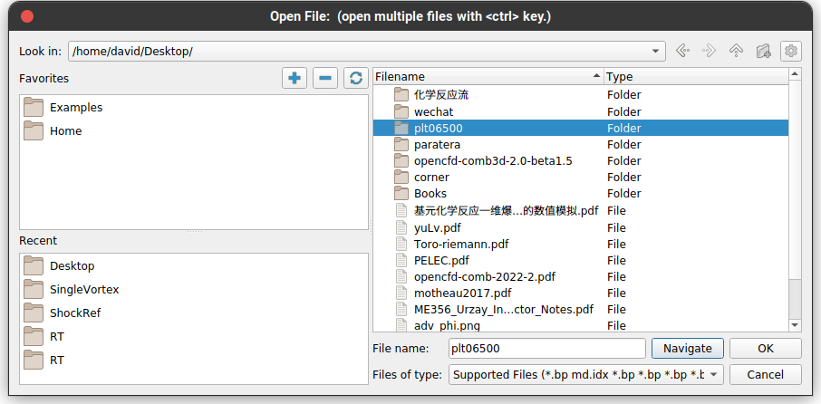
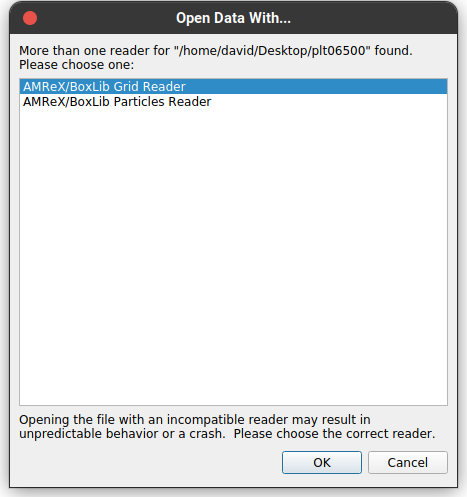
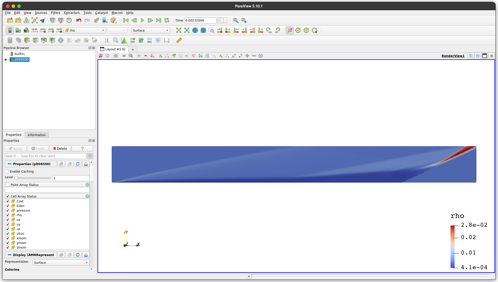
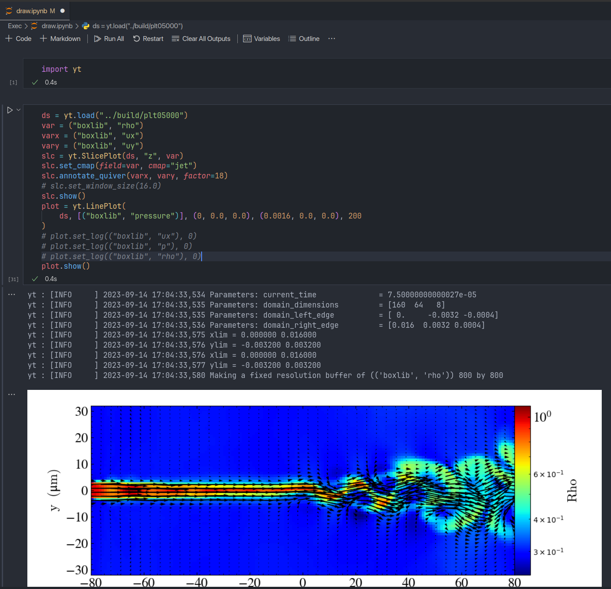

# Usage

## 安装和编译
```bash
git clone --recursive git@github.com:FR13ndSDP/OpenCFD-AMR.git
cd OpenCFD-AMR

cmake -B build; cmake --build build -j <N> # thread number
```

## 运行
编译选项见 `CMakeLists.txt`

```CMake
set(EBAMR_CASE            "7_JET"  CACHE STRING "Case folder")

#
# Physics options
#
option(OPTION_USE_CHEM      "Enable chemical reaction"     ON)

#
# HPC options
#
option(OPTION_MPI    "Enable MPI"    ON)
option(OPTION_OPENMP "Enable OpenMP" OFF)
option(OPTION_CUDA   "Enable CUDA"   OFF)
option(OPTION_HIP    "Enable HIP"    OFF)
option(OPTION_SYCL   "Enable SyCL"   OFF)
```
以此设置为例

```bash
cp ../Exec/7_JET/inputs .
mpirun -n 8 ./EBR.exe inputs
```

## 海光DCU编译运行

### DTK 23.04.1
在东方超算系统上加载系统环境：
```bash
#source /public/paratera_deploy/module.sh
#alias loadenv="module purge; module load dtk/23.04.1 compiler/cmake/3.24.1 compiler/intel/2017.5.239 mpi/hpcx/2.7.4/intel-2017.5.239"
loadenv
```

注意指定C++编译器为 `clang++`:
```CMake
# C++ Options
if (OPTION_HIP)
   set(CMAKE_CXX_COMPILER clang++) # or use hipcc for DTK <=23.04
endif()
```
编译使用方式与普通GPU一致。

### DTK < 23.04.1
在东方超算系统上加载系统环境：
```bash
#alias loadenv="module purge; module load compiler/rocm/dtk/22.10.1 compiler/cmake/3.24.1 compiler/intel/2017.5.239 mpi/hpcx/2.7.4/intel-2017.5.239"
loadenv
```

注意指定C++编译器为 `hipcc`:
```CMake
# C++ Options
if (OPTION_HIP)
   set(CMAKE_CXX_COMPILER hipcc) # or use hipcc for DTK <=23.04
endif()
```

由于海光DTK低版本未实现 `hipDeviceGetUuid`，应使用适配后的AMReX[分支](https://github.com/FR13ndSDP/amrex/tree/DCU)。

```C++
hipUUID uuid;
AMREX_HIP_SAFE_CALL(hipDeviceGetUuid(&uuid, device_id));

char const* sbuf = uuid.bytes;
MPI_Allgather(sbuf, len, MPI_CHAR, pbuf, len, MPI_CHAR,
                ParallelDescriptor::Communicator());
std::map<std::string,int> uuid_counts;
std::string my_uuid;
for (int i = 0; i < ParallelDescriptor::NProcs(); ++i) {
    std::string iuuid(pbuf+i*len, len);
    if (i == ParallelDescriptor::MyProc()) {
        my_uuid = iuuid;
    }
    ++uuid_counts[iuuid];
}
num_devices_used = uuid_counts.size();
num_device_partners = uuid_counts[my_uuid];
```
这段代码将统计位于同一节点的GPU数量，用于分配全局内存，由于无法获取UUID，我们直接设定 `num_device_partners` 为 4 或 1。

在`OpenCFD-AMR`根目录执行：
```bash
cmake -B build -DCMAKE_CXX_COMPILER=$(which hipcc)
# 修正链接错误
sed -i 's/\.\.//g' build/CMakeFiles/ebamr.dir/link.txt
cmake --build build -j
```

## 可视化

结果文件为`plt*`，可使用Paraview打开




或 `pip install yt` 使用jupyter-notebook。

