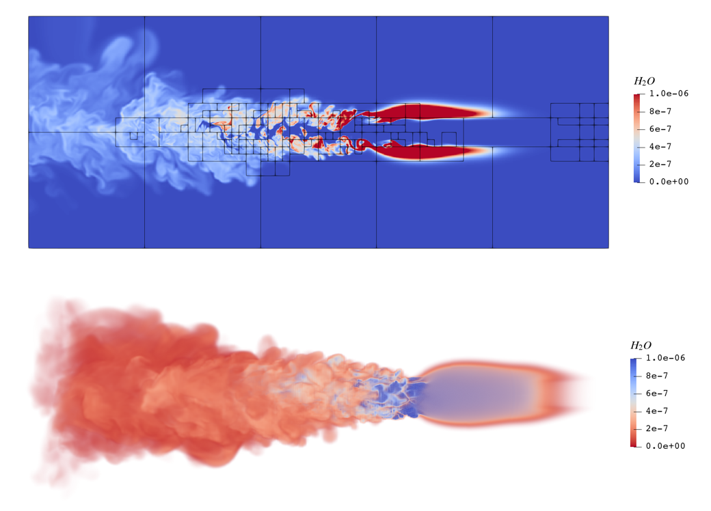

# Validation

## 1. 射流燃烧


_开启化学反应，单层网格, 160x64x64, 计算100步_

- 编译选项：
```CMake
#
# Base options
#
set(EBAMR_DIM             "3"        CACHE STRING "Number of physical dimensions")
set(EBAMR_PRECISION       "DOUBLE"   CACHE STRING "Floating point precision SINGLE or DOUBLE")
set(EBAMR_CASE            "7_JET"    CACHE STRING "Case folder")
#
# Physics options
#
option(OPTION_USE_CHEM      "Enable chemical reaction"     ON)

#
# Misc options
#
option(OPTION_ENABLE_TINY_PROFILE "Enable AMReX tiny profiler" ON)
option(OPTION_ENABLE_HDF5         "Enable HDF5 PlotFiles"      OFF)
option(OPTION_ENABLE_HYPRE        "Enable Hypre"               OFF)
option(OPTION_ENABLE_SUNDIALS     "Enable Sundials integrator" OFF)

#
# HPC options
#
option(OPTION_MPI    "Enable MPI"    OFF)
option(OPTION_OPENMP "Enable OpenMP" OFF)
option(OPTION_CUDA   "Enable CUDA"   ON)
option(OPTION_HIP    "Enable HIP"    OFF)
option(OPTION_SYCL   "Enable SyCL"   OFF)

# C++ Options
set(CMAKE_CXX_STANDARD 17)
set(CMAKE_CXX_EXTENSIONS OFF)
set(CMAKE_CXX_STANDARD_REQUIRED ON)
set(CMAKE_BUILD_TYPE Release)
```

- 运行时输入
```Ini
max_step  = 100
stop_time = 0.14

geometry.is_periodic = 0 0 0
geometry.coord_sys   = 0  # 0 => cart, 1 => RZ  2=>spherical
geometry.prob_lo     =   0.0     -0.0032  -0.0032
geometry.prob_hi     =   0.016    0.0032   0.0032
amr.n_cell           =   160      64       64

# >>>>>>>>>>>>>  BC FLAGS <<<<<<<<<<<<<<<<
# 0 = Interior           3 = Symmetry
# 1 = Inflow             4 = SlipWall
# 2 = Outflow            5 = NoSlipWall
# >>>>>>>>>>>>>  BC FLAGS <<<<<<<<<<<<<<<<
ebr.lo_bc       =  1   2   2
ebr.hi_bc       =  2   2   2

ebr.cfl = 1.0  # cfl number for hyperbolic system

ebr.v = 2
amr.v = 1

# LOAD BALANCE
amr.loadbalance_with_workestimates = 0
amr.loadbalance_level0_int = 1000

# REFINEMENT / REGRIDDING 
amr.check_input     = 1       # 
amr.max_level       = 0       # maximum level number allowed
amr.ref_ratio       = 2 2 2 2 # refinement ratio
amr.regrid_int      = 2 # how often to regrid
amr.blocking_factor = 16
amr.max_grid_size   = 256
amr.n_error_buf     = 0 # number of buffer cells in error est
amr.grid_eff        = 1     # what constitutes an efficient grid

# CHECKPOINT FILES
amr.checkpoint_files_output = 0
amr.check_file              = chk    # root name of checkpoint file
amr.check_int               = 100    # number of timesteps between checkpoints

# PLOTFILES
amr.plot_files_output = 0
amr.plot_file         = plt     # root name of plotfile
amr.plot_int          = 200     # number of timesteps between plotfiles
amr.derive_plot_vars  = pressure velocity T

ebr.refine_dengrad = 0.1
ebr.refine_max_dengrad_lev = 4
ebr.do_reflux = false
ebr.time_integration = RK2
ebr.do_visc = true

# EB parameters
eb2.geom_type = none

# Error handling
amrex.fpe_trap_invalid=0  # NaN, turn this off for GPU profiling
amrex.fpe_trap_zero=0     # devided by zero
amrex.fpe_trap_overflow=0 # overflow
```

**On CPU**: i9-12900k (mpirun -n 8) : **325.6690344** _s_

|Hygon DCU | DCUx4 | RTX 3080   | Tesla V100  | A10 | A10x4 | A10 1.6x grid| A10x4 1.6x grid|
| ---- | ---- |  ----  | ----  | ---- | ---- | ---- |  ---- |
| 37.21853068 | 12.6149422 | 79.97765838  | 20.14456375 | 86.84865471 | 30.5222507 | 139.4827673 | 39.89737012 |